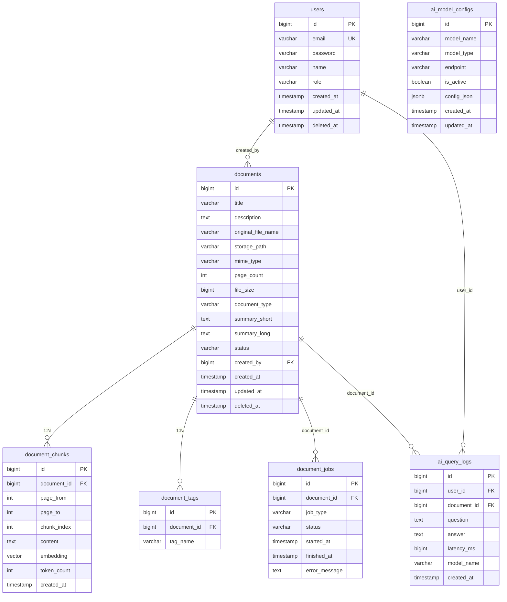

# PaperLens (PdfStudy)

<br/>


<br/>
## 1. 프로젝트 소개

**PaperLens**는 PDF 문서를 업로드하고, AI 기반 검색·요약·질의응답을 제공하는 문서 관리 플랫폼입니다.

- **목적**: PDF를 저장하고 내용을 검색·분석하여 필요한 정보를 빠르게 찾을 수 있도록 지원
- **기술 포인트**: 벡터 임베딩(pgvector)과 키워드 검색을 결합한 **하이브리드 검색**, Spring AI를 활용한 **문서 요약·QA**
- **대상**: 내부 문서(계약서, 매뉴얼, 제안서, 보고서 등)를 체계적으로 관리하고 싶은 팀·개인

---

## 2. 프로젝트 기능

### 인증

- 이메일/비밀번호 로그인
- JWT 기반 인증
- 역할: 일반 사용자(USER), 관리자(ADMIN)

### 문서 관리

- **PDF 업로드**: 파일 업로드 후 자동 메타정보 추출 및 인덱싱
- **문서 목록**: 페이지네이션, 상태(대기/처리중/완료/실패) 표시
- **문서 상세**: PDF 뷰어, 메타정보·요약·태그·다운로드
- **문서 삭제**: 소프트 삭제(deleted_at)

### 검색

- **하이브리드**: 키워드 + 의미(벡터) 검색 결합
- **키워드**: 전통적인 전문 검색
- **의미 검색**: 임베딩 유사도 기반
- **푸지**: 오타 허용 검색
- 문서 유형 필터(계약서, 매뉴얼, 제안서 등)

### AI 기능

- **문서 요약**: 3줄 요약(summary_short), 상세 요약(summary_long)
- **문서 기반 Q&A**: 선택한 문서에 대해 질문하면 답변 + 출처(챕터/페이지) 제공
- **유사 문서**: 현재 문서와 의미적으로 유사한 문서 추천

### 관리자

- **대시보드**: 전체/인덱싱완료/실패 문서 수, 인덱싱 성공률, 총 질문 수, 평균 응답 시간
- **실패 문서 재처리**: 상태가 FAILED인 문서 재인덱싱

---

## 3. ERD



### 테이블 요약

| 테이블             | 설명                                  |
| ------------------ | ------------------------------------- |
| `users`            | 사용자(이메일, 역할 등)               |
| `documents`        | PDF 메타정보, 요약, 상태              |
| `document_chunks`  | 문서를 나눈 텍스트 조각 + 벡터 임베딩 |
| `document_tags`    | 문서별 태그                           |
| `document_jobs`    | 인덱싱/처리 작업 큐                   |
| `ai_query_logs`    | Q&A 질문·답변·응답시간 로그           |
| `ai_model_configs` | 임베딩/챗 모델 설정                   |

---

## 4. 프로젝트 아키텍처

### 전체 구성도

```
┌─────────────────────────────────────────────────────────────────────────┐
│                           Client (Browser)                               │
│  Vue 3 + Vue Router + Pinia + Tailwind CSS + PDF.js + Chart.js           │
└─────────────────────────────────┬───────────────────────────────────────┘
                                  │ HTTP /api/* (proxy → :8080)
                                  ▼
┌─────────────────────────────────────────────────────────────────────────┐
│                     Backend (Spring Boot 3 + Kotlin)                      │
│  ┌─────────────┐ ┌─────────────┐ ┌─────────────┐ ┌─────────────────────┐ │
│  │ Auth        │ │ Document    │ │ Search      │ │ AI (Summary, QA,    │ │
│  │ (JWT)       │ │ (CRUD, Job) │ │ (Hybrid)    │ │  Embedding, Similar)│ │
│  └─────────────┘ └─────────────┘ └─────────────┘ └─────────────────────┘ │
│  ┌─────────────┐ ┌─────────────┐                                         │
│  │ Viewer      │ │ Admin       │  Spring Security, JPA, Spring AI       │
│  │ (PDF serve) │ │ (Stats)      │                                         │
│  └─────────────┘ └─────────────┘                                         │
└──────────┬──────────────────────────────┬───────────────────┬──────────┘
           │                              │                   │
           ▼                              ▼                   ▼
┌──────────────────────┐    ┌──────────────────────┐   ┌─────────────┐
│  PostgreSQL 16       │    │  Redis 7              │   │  OpenAI API │
│  + pgvector          │    │  (캐시/세션 등)        │   │  (선택)     │
│  + Flyway migration  │    │                      │   │  Embedding  │
└──────────────────────┘    └──────────────────────┘   │  Chat       │
                                                        └─────────────┘
```

### 스택 요약

| 구분         | 기술                                                                                                            |
| ------------ | --------------------------------------------------------------------------------------------------------------- |
| **Frontend** | Vue 3, TypeScript, Vite, Vue Router, Pinia, Tailwind CSS, Axios, PDF.js, Chart.js, Lucide Icons                 |
| **Backend**  | Spring Boot 3.3, Kotlin 2.0, Spring Security, JPA, Spring AI (OpenAI / Transformers), JWT, Flyway, PDFBox, Tika |
| **DB**       | PostgreSQL 16 + pgvector (벡터 검색), Redis 7                                                                   |
| **인프라**   | Docker Compose (PostgreSQL, Redis)                                                                              |
